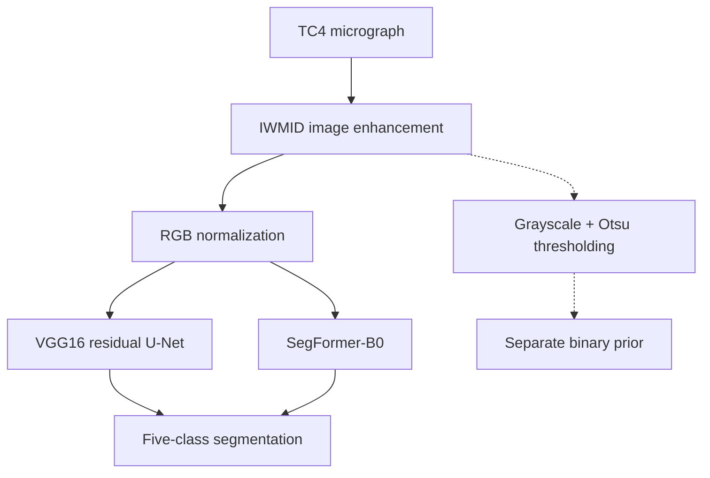

<h1 align="center">Automated Microstructure Segmentation in Titanium Alloys Using Deep Learning Techniques</h1>

<p align="center">
  <a href="https://github.com/Eric-lfmself/Automated-Microstructure-Segmentation-in-Titanium-Alloys-Using-Deep-Learning-Techniques/actions/workflows/tests.yml"></a>
  <a href="pyproject.toml"></a>
  <a href="LICENSE"></a>
</p>

<p align="center">
  <a href="#experimental-results">Results</a> ·
  <a href="#method-overview">Method</a> ·
  <a href="#quick-start">Quick start</a> ·
  <a href="#training-and-evaluation">Training</a> ·
  <a href="#documentation">Documentation</a> ·
  <a href="#citation">Citation</a>
</p>

We segment **Ti–6Al–4V (TC4) microstructures into five classes**: equiaxed α grains and four colony orientation classes. Our study compares a **VGG16-based residual U-Net** with **SegFormer-B0**, using IWMID image enhancement and a shared training and evaluation pipeline.

<p align="center">
  
</p>

*Qualitative results from our paper (Figure 6). Left to right: micrograph, ground truth, VGG U-Net and SegFormer. [View the original figures and training curves →](assets/paper/README.md)*

## Experimental results

**Our VGG-based U-Net achieves 90.0% pixel accuracy.** We report the comparison below in Table 3; all table values are fractions.

| Model | Pixel accuracy | mIoU | Equiaxed α IoU | Mean colony IoU |
| :--- | ---: | ---: | ---: | ---: |
| VGG-based U-Net | **0.9000** | **0.6989** | **0.8746** | 0.6538 |
| SegFormer | 0.8449 | 0.6725 | 0.8410 | **0.6725** |

Our full pipeline takes approximately **36 seconds per 1024 × 1024 image**, compared with **15 minutes** for manual annotation: approximately **25× faster** (Section 3.4).

We release [Tables 1–3 and timing results as CSV and JSON](results/paper/README.md), preserving the values reported in our paper. The [aggregation notes](results/paper/AGGREGATION.md) document differences between Table 3 and means calculated from the printed per-class scores. The timing above covers the full paper pipeline; local evaluation reports model inference time separately.

## Method overview

The diagram below shows the public implementation. Both architectures receive three-channel RGB inputs and produce five-class segmentation maps.



We train and evaluate the two models independently. The Otsu prior is exposed separately by the data interface. Training uses orientation-preserving augmentation and weighted cross-entropy; evaluation reports pixel accuracy and IoU from a dataset-wide confusion matrix. See [Methods](docs/METHODS.md) for equations, architecture details and configuration defaults.

## Quick start

**Requirements:** Python 3.11 or 3.12. Use that interpreter for `python3` below. The commands use a POSIX shell (Linux/macOS); the command-line implementation runs on CPU.

```sh
git clone \
  https://github.com/Eric-lfmself/Automated-Microstructure-Segmentation-in-Titanium-Alloys-Using-Deep-Learning-Techniques.git \
  tc4-segmentation
cd tc4-segmentation

python3 -m venv .venv
source .venv/bin/activate
python -m pip install --upgrade pip
python -m pip install -e .

# Exercise both complete model pipelines.
python -m scripts.smoke
```

The smoke check needs **no microscopy data or pretrained weights**. Each model performs one optimizer update on two synthetic 64 × 64 images, followed by validation, checkpoint loading and evaluation. Once dependencies are installed, it runs offline.

**Successful output:** a new `runs/smoke_<timestamp>/` directory containing `SMOKE_STATUS.json` with `"status": "passed"`, a model comparison, checkpoints and evaluation previews. These small synthetic runs validate the software; the experimental results above come from our paper.

<details>
<summary><strong>Run the test suite or export the paper tables</strong></summary>

```sh
python -m pytest -q
python -m scripts.export_paper_results --output-dir runs/paper_tables
```

The export command writes the reported results without running a model. Choose an empty output directory. We pin dependency versions in [requirements.txt](requirements.txt), and our [automated checks](https://github.com/Eric-lfmself/Automated-Microstructure-Segmentation-in-Titanium-Alloys-Using-Deep-Learning-Techniques/actions/workflows/tests.yml) run the tests, both model pipelines and result export.

</details>

## Training and evaluation

Prepare separate training, validation and test CSV manifests of your local image/mask pairs using the [data format guide](data/README.md). Then copy the configuration template:

```sh
cp configs/real_template.json configs/my_experiment.json
```

Edit `configs/my_experiment.json` to set the three manifest paths, model (`unet_vgg` or `segformer_b0`) and training settings. Set `weights_path` to the local pretrained encoder, or set `use_random_init=true` to train from scratch. Set `output_dir` to `runs/my_experiment`, then run:

```sh
python -m scripts.check_config --config configs/my_experiment.json
python -m scripts.train --config configs/my_experiment.json --run-real
python -m scripts.evaluate --config configs/my_experiment.json --run-real \
  --checkpoint runs/my_experiment/checkpoint.pt --output-dir runs/my_evaluation
```

The [usage guide](docs/USAGE.md) covers supported weight formats, resuming training, comparing models and troubleshooting.

**Data and checkpoints.** Our study uses the 112-image dataset described in Section 2.1. We release the paper's numerical results and figure excerpts here; microscopy images, annotation masks, split membership and trained checkpoints are not included. See [data availability](docs/DATA_AVAILABILITY.md) for the dataset source and release scope.

## Documentation

| I want to… | Start here |
| :--- | :--- |
| Understand the equations and architectures | [Methods](docs/METHODS.md) |
| Inspect the reported numbers | [Results archive](results/paper/README.md) · [Aggregation notes](results/paper/AGGREGATION.md) |
| View qualitative results and training curves | [Paper figures](assets/paper/README.md) |
| Prepare images, masks and data splits | [Data format](data/README.md) · [Data availability](docs/DATA_AVAILABILITY.md) |
| Train, resume or evaluate a model | [Usage guide](docs/USAGE.md) |
| Check the software validation coverage | [Validation](docs/VALIDATION.md) |

<details>
<summary><strong>Repository layout</strong></summary>

```text
configs/          Configuration and local-data template
preprocessing/    IWMID enhancement and Otsu thresholding
data/             Dataset interfaces and paired transforms
models/           VGG16 residual U-Net and SegFormer-B0
losses/           Shared weighted cross-entropy
training/         Training, checkpoints, resume and learning curves
eval/             Pixel accuracy, IoU and timing
scripts/          Training, evaluation, visualization and result export
tests/            Numerical, model, data and workflow checks
results/paper/    Experimental tables and source locations
assets/paper/     Original manuscript figure excerpts
docs/             Methods, usage and data availability
```

</details>

## Citation

Please cite our paper when using this code or the experimental results:

```bibtex
@misc{wang_tc4_microstructure,
  title = {Automated Microstructure Segmentation in Titanium Alloys Using Deep Learning Techniques},
  author = {Wang, Ruilang and Zhao, Yi and Ye, Ziqi and Liu, Bowen and Li, Yucheng and Chen, Donglong}
}
```

Citation files: [BibTeX](citation.bib) · [CITATION.cff](CITATION.cff).

## License

We release the code and software documentation under the [MIT License](LICENSE). Manuscript figure excerpts retain their manuscript copyright; [RIGHTS.md](RIGHTS.md) describes the license scope and third-party materials.
