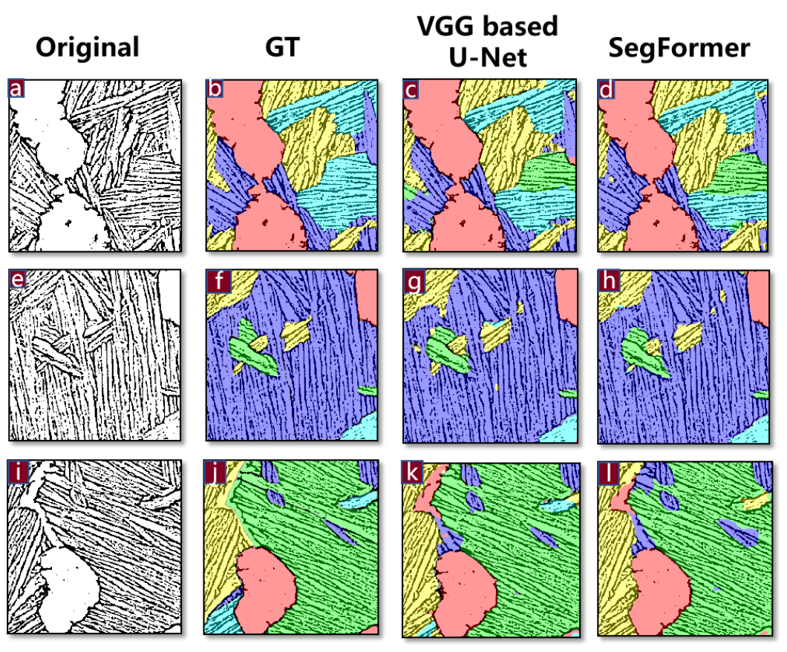

# Automated Microstructure Segmentation in Titanium Alloys Using Deep Learning Techniques

Code and experimental results for **Automated Microstructure Segmentation in Titanium Alloys Using Deep Learning Techniques**.

We study five-class semantic segmentation of Ti-6Al-4V (TC4) microstructures. Our pipeline combines IWMID enhancement and Otsu binarization with a VGG16-based residual U-Net or SegFormer-B0. We distinguish equiaxed alpha grains and four colony orientation classes.

[Experimental results](results/paper/README.md) · [Methods](docs/METHODS.md) · [Data format](data/README.md) · [Training and evaluation](docs/USAGE.md) · [Citation](CITATION.cff) · [Software validation](docs/VALIDATION.md)

## Experimental results

We report the following comparison in Table 3 of our paper. Scores are fractions, not percentages.

| Model | Pixel accuracy | mIoU | Equiaxed alpha IoU | Mean colony IoU |
| --- | ---: | ---: | ---: | ---: |
| VGG-based U-Net | 0.9000 | 0.6989 | 0.8746 | 0.6538 |
| SegFormer | 0.8449 | 0.6725 | 0.8410 | 0.6725 |

We release the per-class scores from Tables 1 and 2, the comparison in Table 3, and the timing measurements from Section 3.4 as [CSV and JSON](results/paper/README.md). We retain the reported values exactly and list differences between Table 3 and arithmetic means of the printed class scores in [aggregation notes](results/paper/AGGREGATION.md).

Our full pipeline processes a 1024 × 1024 image in approximately **36 seconds**, compared with approximately **900 seconds** for manual annotation, a **25×** throughput improvement (Section 3.4).



*Figure 6 from our paper. We include the original figure and training curves in [assets/paper](assets/paper/README.md).*

## Installation

We support Python 3.11–3.12. Create an environment inside the repository:

```sh
python3 -m venv .venv
source .venv/bin/activate
python -m pip install --upgrade pip
python -m pip install -e .
```

The dependency versions are fixed in [requirements.txt](requirements.txt). The command-line implementation uses CPU execution. We keep network access off by default and support local pretrained encoder weights.

## Quick start

```sh
# Validate both model pipelines without datasets or pretrained weights.
python -m scripts.smoke

# Run the unit and integration tests.
python -m pytest -q

# Export the experimental tables from our paper to a separate directory.
python -m scripts.export_paper_results --output-dir runs/paper_tables
```

The smoke check uses two synthetic 64 × 64 images per model and one optimizer update. It exercises training, validation, checkpoint saving/loading, evaluation and comparison. Its outputs are software checks; the experimental tables above come from our paper.

## Using local data

We provide a CSV interface for image/mask pairs and explicit train, validation and test splits. See [data/README.md](data/README.md) for the class mapping and [docs/USAGE.md](docs/USAGE.md) for configurations, pretrained weights, training, resume and evaluation.

```sh
python -m scripts.train --config configs/my_experiment.json --run-real
python -m scripts.evaluate --config configs/my_experiment.json --run-real \
  --checkpoint runs/my_experiment/checkpoint.pt --output-dir runs/my_evaluation
```

Create `configs/my_experiment.json` from [configs/real_template.json](configs/real_template.json) and fill in the local paths before running these commands. We do not distribute microscopy images, masks, split membership or trained checkpoints in this repository. Our study uses the 112-image dataset described in Section 2.1 and attributed there to Chen et al.; [data availability](docs/DATA_AVAILABILITY.md) distinguishes the released result tables from the image dataset.

## Repository layout

```text
configs/          Configuration and local-data template
preprocessing/    IWMID enhancement and Otsu thresholding
data/             Dataset interfaces, paired transforms and split fingerprints
models/           VGG16 residual U-Net and SegFormer-B0
losses/           Shared weighted cross-entropy
training/         Training, checkpoints, resume and learning curves
eval/             Pixel accuracy, IoU and timing
scripts/          Training, evaluation, visualization and result export
tests/            Numerical, model, data and workflow checks
results/paper/    Experimental tables and their source locations
assets/paper/     Original figures extracted from our manuscript
docs/             Methods, usage and data availability
```

## Citation and rights

Please cite our paper when using this code or the experimental results. Author and title metadata are provided in [CITATION.cff](CITATION.cff) and [citation.bib](citation.bib).

We release the code and software documentation under the [MIT License](LICENSE). See [RIGHTS.md](RIGHTS.md) for the scope of this license and the separate treatment of manuscript figures and third-party materials.
