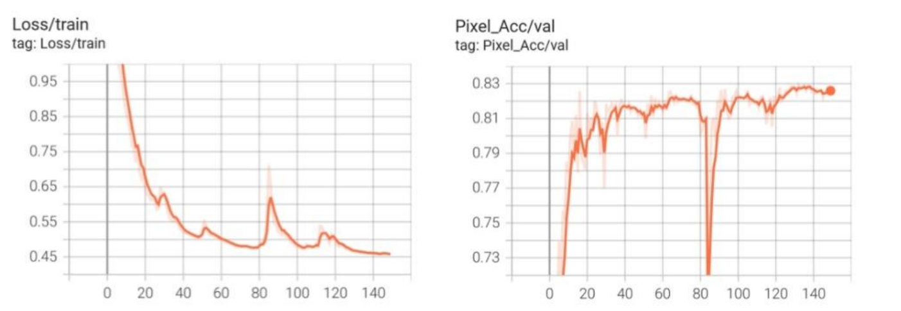
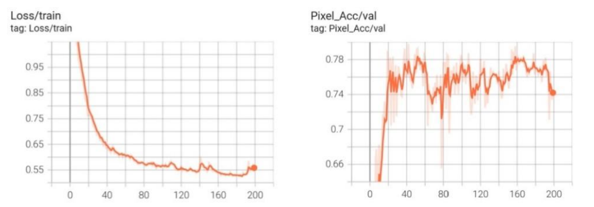

# Figures from our paper

We include direct excerpts of the original figures, preserving their labels and plotted content. Source pages refer to the manuscript PDF; extraction coordinates and checksums are in [figure_sources.json](figure_sources.json).

## Figure 4: VGG U-Net training

Source: Figure 4, manuscript page 5. We retain the curves as figure images; this file is not a per-epoch numerical log.

## Figure 5: SegFormer training

Source: Figure 5, manuscript page 5. The plotted curves and approximate values discussed in Section 3.1 are retained in their original forms.

## Figure 6: Qualitative segmentation

Source: Figure 6, manuscript page 7. Columns show the test images, ground truth, VGG U-Net and SegFormer results. This figure excerpt is not a release of the full-resolution image dataset or individual prediction arrays.
